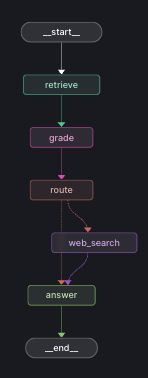

User Query

   │
   ▼

VectorDB Lookup ────► Grading ──(low grade)──► Web Search (Tavily)

   │                          │

   │(good grade)              ▼

   └──────────────►  build_answer (LLM)

🧭 Step-by-Step Design (LangGraph)
1. Nodes Definition

You’ll likely need these nodes:

    1. retrieve — query vector store (Chroma)

    2. grade— use an LLM (or scoring heuristic) to judge relevance / confidence.

    3. route — decide whether to go to web or build answer directly.

    4. web_search— fallback to Tavily API if docs are missing or low quality.

    5. answer — final synthesis (e.g., RAG answer generation with context).

⚡ Additional Pro Tips

✅ Cache Tavily results → optionally store them in your vector DB so next time it’s a direct hit.

🧪 Grading can be made more sophisticated: combine cosine similarity + LLM reasoning.

🕵️ Confidence scoring helps filter noisy vector DB results.

🧭 Consider a reranking step (e.g., Cohere Rerank or OpenAI embeddings) before grading to boost quality.

🧠 Keep grading lightweight — don’t run heavy LLMs unnecessarily.

VectorDB hit? No or low → Tavily Search → Build answer.

✅ Result: You get a robust retrieval system that uses your knowledge base first, then falls back to web search, and ensures only high-quality info is used for the final answer.

